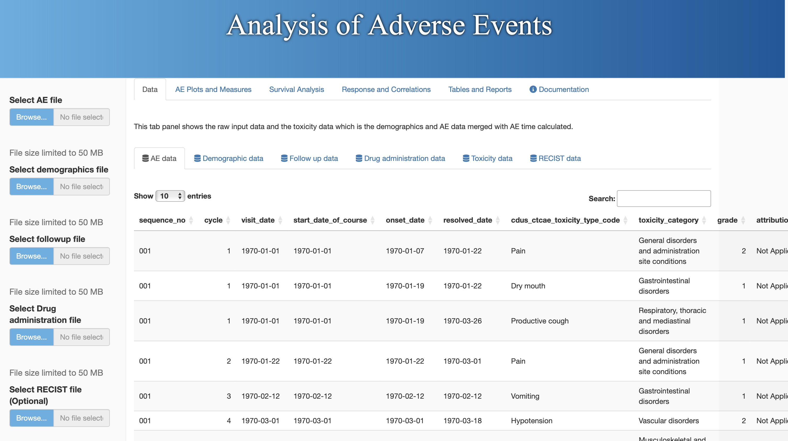
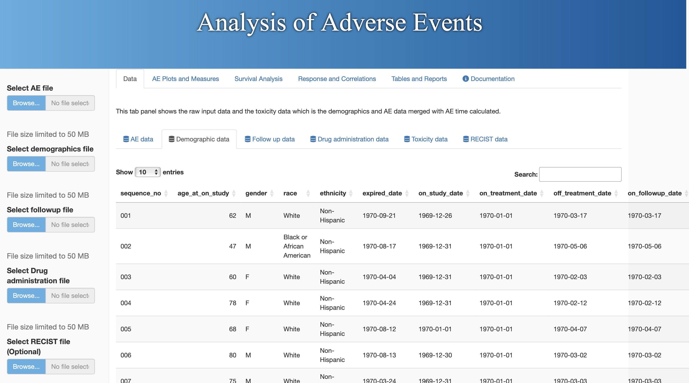
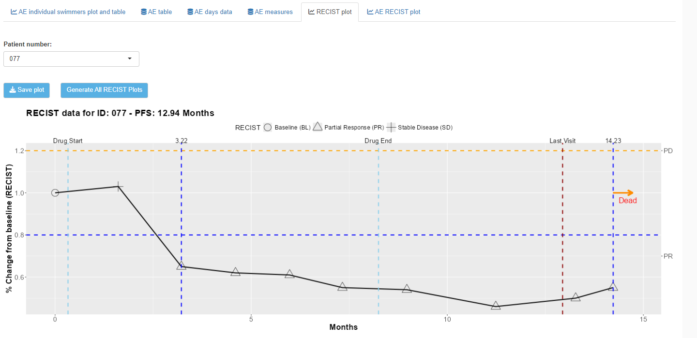
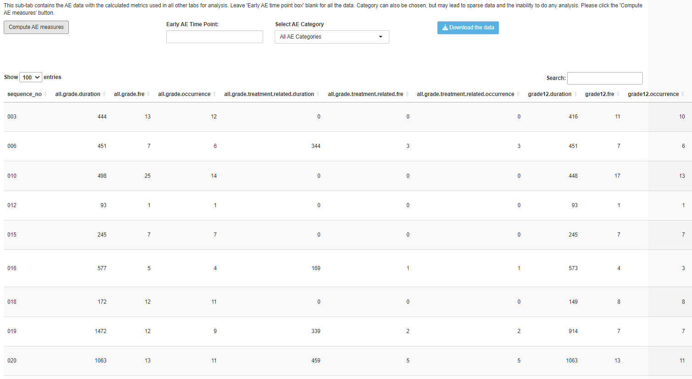
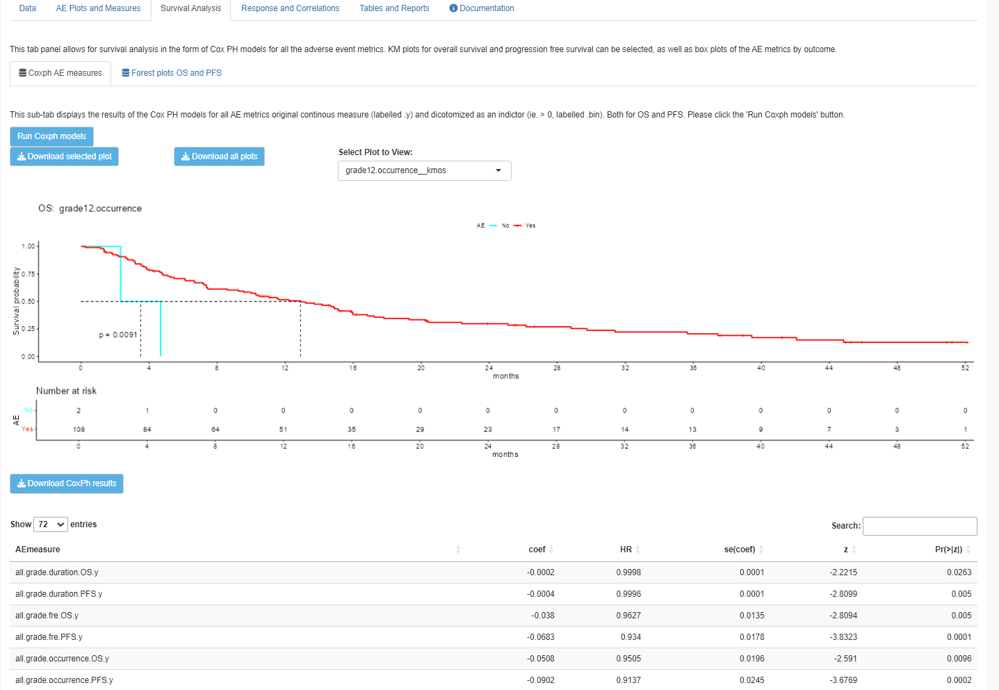
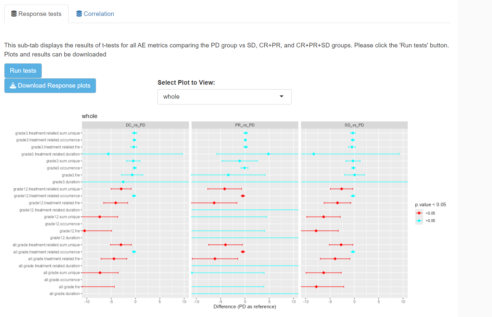
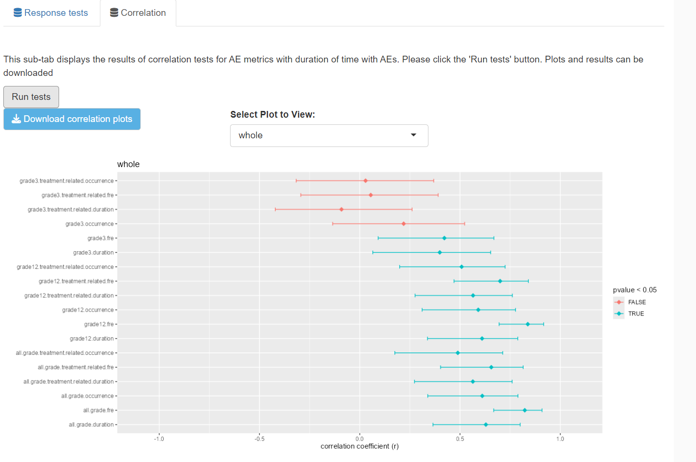
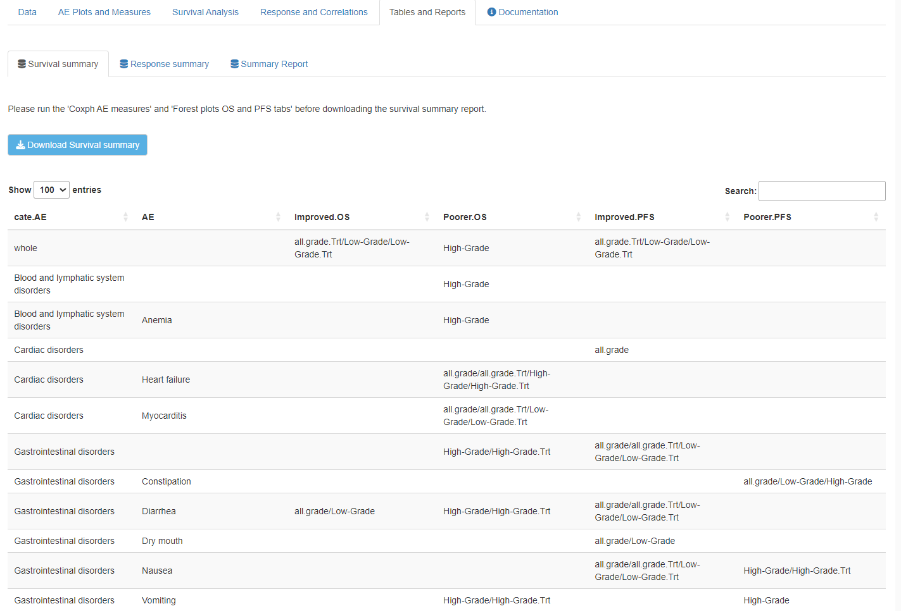
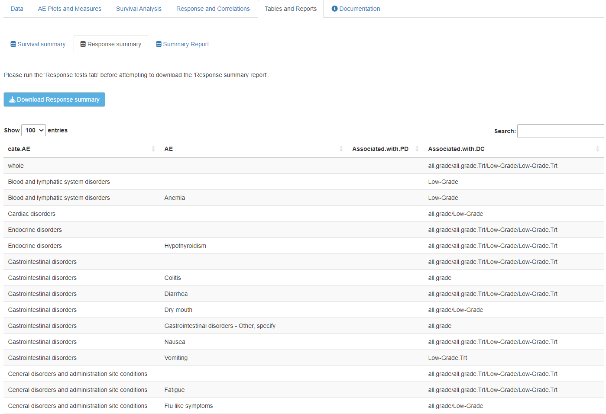

### Getting Started
You can install packages directly from Github  with a couple R lines of code.

```r

# Installing from GitHub
remotes::install_github("https://github.com/dungtsa/AdverseEvents", build_opts = NULL)

# Loading MoffittFunctions and Example Dataset
library(AdverseEvents)

```


# Introduction 

This is an application for analysis of Adverse Event (AE) data from Oncore. The application requires 4 data sets (a 5th tumor measurement file,
with RECIST format as response is optional for additional plots). In the OnCore biostats console download the clinical trial data from the "Data Export" page by selecting the protocol number, clicking "Use Descriptions" in export options, and finally click export. See the Oncore data export screen shot. 

- Demographics
- Follow up
- Drug administration data
- Adverse event data
- RECIST data (optional)


# Running the app

Once installed run the function runAEapp() to launch a browser with the application and demo data will be loaded. 


# RECIST data

RECIST (Response Evaluation Criteria in Solid Tumors) is a set of standardized criteria used to assess how well a tumor responds to treatment in clinical trials, particularly for cancer therapies. These criteria provide a consistent method for measuring tumor size and determining changes in tumor burden over time. Developed by an international collaboration of cancer organizations, RECIST ensures that tumor response can be compared across different studies.

### Key Aspects of RECIST:
1. **Tumor Measurement**: Tumors are classified as target or non-target lesions. Target lesions are selected for precise measurement, while non-target lesions are qualitatively assessed.
   - Target lesions are measured in their longest diameter (except for lymph nodes, which are measured in their short axis).
   - Up to five target lesions are typically selected for measurement, with a maximum of two per organ.

2. **Response Categories**:
   - **Complete Response (CR)**: Disappearance of all target lesions.
   - **Partial Response (PR)**: At least a 30% decrease in the sum of the diameters of target lesions, compared to the baseline.
   - **Progressive Disease (PD)**: At least a 20% increase in the sum of the diameters of target lesions, or the appearance of new lesions.
   - **Stable Disease (SD)**: Neither sufficient shrinkage to qualify for PR nor sufficient increase to qualify for PD.

3. **Evaluation Frequency**: Tumor measurements are taken at regular intervals during treatment to monitor changes. The results are used to assess whether the treatment is effective, should be continued, or requires adjustment.

### Importance of RECIST:
- **Standardization**: Provides a consistent and objective way to assess tumor response across different clinical trials.
- **Treatment Evaluation**: Helps determine whether a therapy is working by objectively measuring changes in tumor size.
- **Regulatory Use**: Used by regulatory agencies like the FDA and EMA to evaluate the efficacy of new cancer treatments.

Overall, RECIST is a critical tool in oncology research and clinical practice, guiding decisions about patient care and drug approval.

If using tumor measurement/RECIST data the each subject must have baseline measures and follow up measure for the target lesions.
The response should be one of the following: 

[1] "Baseline (BL)"        

[2] "Stable Disease (SD)"    

[3] "Progressive Disease (PD)"

[4] "Partial Response (PR)"   

[5] "Not Evaluable (NE)"


## Data tab 

This is the home page (data tab), on the left upload the data. There are multiple tabs to view each of the raw uploaded
data sets and the toxicity data is constructed from merging the uploaded data. 


{width=80%}

On the data page there are 5 sub-tabs:

- AE data
- Demographic data
- Follow up data
- Drug administration data
- Toxicity data

Screen shot of the demographic data:

{width=80%}

## AE Plots and Measures

The next tab panel is the AE Plots and Measures page. This tab panel contains a swimmers plot of adverse events and 
tables of AEs. It also provides download buttons to save the plots and data. The AE measures sub-tab contains the
data with the calculated AE metrics used in all other tabs for analysis. One must click "Calculate measures" before the 
Survival analysis and correlation and response tests can be done. 

On the data page there are 4 sub-tabs:

- AE individual swimmers plot and AE table by grade
- AE table data (aggregated)
- AE days data
- AE measures
- RECIST plot

 {width=75%}


 {width=75%}
  

### AE measures 

This data set contains all the AE variables for analysis on subsequent tabs. 
It creates 18 variables, 6 for all grade AEs, 6 for low grade (1,2) and 6 for grade 3 AEs. 
Half of the AE variables are calculated for all AEs and half are calculated for treatment related AEs.

- all.grade.duration
- all.grade.fre
- all.grade.occurrence
- all.grade.treatment.related.duration
- all.grade.treatment.related.fre
- all.grade.treatment.related.occurrence
- grade12.duration
- grade12.fre
- grade12.occurrence
- grade12.treatment.related.duration
- grade12.treatment.related.fre
- grade12.treatment.related.occurrence
- grade3.duration
- grade3.fre
- grade3.occurrence
- grade3.treatment.related.duration
- grade3.treatment.related.fre
- grade3.treatment.related.occurrence

The duration is measured in days these are continuous measures and are the total number of days with an AE.
Fre denotes the frequency of AEs. Occurrence is the unique number of occurrences.  

Entering a number in the "Early AE Time Point" box will use that time as a cutoff. Example: if 30 is used
only AEs in the first 30 days will be used. 


 {width=75%}
 
## Survival Analysis 

This tab panel allows for survival analysis in the form of Cox PH models for all the adverse event metrics. Kaplan-Meier (KM) plots for overall survival (OS) and progression free survival (PFS) can be selected, as well as box plots of the AE metrics by outcome (partial response, stable disease, progressive disease).

- Cox proportional hazards (ph) measures
- Forest plots OS and PFS

The Coxph measures sub-tab displays the results of Cox PH models for all AE metrics: original continuous measure (labelled .y) and dicotomized as an indicator (ie. > 0, labelled .bin). Both for OS and PFS. Please click the 'Run Coxph models' button


{width=75%}
                                         
The forest plot sub-tab displays forest plots for OS and PFS for all the AE metrics. The analysis builds on the Coxph measures tab analysis but it includes 6 more AE metrics for the unique number of AEs. It also can run the models on particular types of adverse events, specified in the drop down box under "Select plot to view". This sub-tab also includes a table of the results. 


{width=75%}

## Response and Correlation tab

This panel has two sub-panels.

- Response tests
- Correlation 

The response tests tab runs t-tests comparing the AE metrics between the disease control group (complete response + partial response + stable disease) vs progressive disease groups (DC vs PD), partial response vs progressive disease groups (PR vs PD), and stable disease vs progressive disease groups (SD vs PD). Bar plots of p values are displayed along with a table of results (p value and difference) by AE type. Similar to the forest plot panel there is a drop box for AE category. 

{width=75%}

The correlation tab displays a bar plot of the Pearson's correlation coefficient for each AE metric with treatment time. There are also two tables. A text table with the AE category, AE type, and a summary of which type of metric has a negative or positive correlation with treatment time. A second table of numeric results is also displayed and both tables are downloadable. 


{width=75%}


## Tables and reports 


- Survival analysis 
- Response analysis 
- Summary report 

These sub tabs produce text tables summarizing the relationship between the AE metrics and OS and PFS by AE category and AE type.
The survival analysis and response tests must be run before these tables will be displayed. Each table can be downloaded as a CSV file. The summary report sub-tab is a pdf that can be downloaded. 


{width=75%}


{width=75%}
