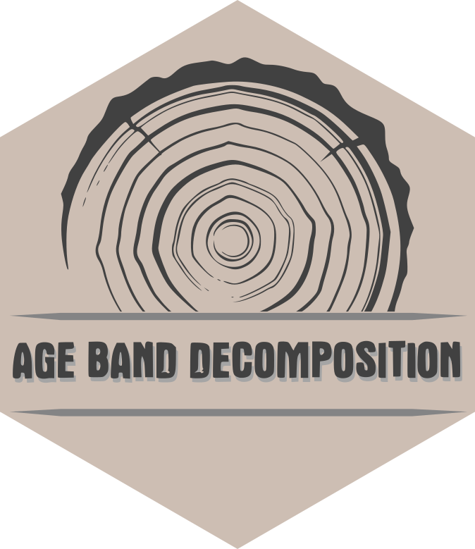

# AgeBandDecomposition

=======


<!--require(knitr);require(markdown);knit("README.Rmd")-->

**Authors:** [Nicola Puletti](https://orcid.org/0000-0002-2142-959X), 
[Gianluigi mazza](https://orcid.org/0000-0002-2744-2330)<br/>
**License:** [GPL3](https://cran.r-project.org/web/licenses/GPL-3)

`AgeBandDecomposition` provides tools for tree-ring standardization based on the Age Band Decomposition (ABD) method, for tree ring width standardization.

## Installation

Install the stable version from CRAN (when available)

```r
install.packages("agebanddecomposition")
```

or the development version from GitHub

```r
# install.packages("devtools")
remotes::install_git("https://gitlab.com/Puletti/agebanddecomposition_rpackage")
```
