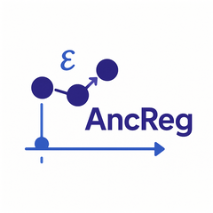
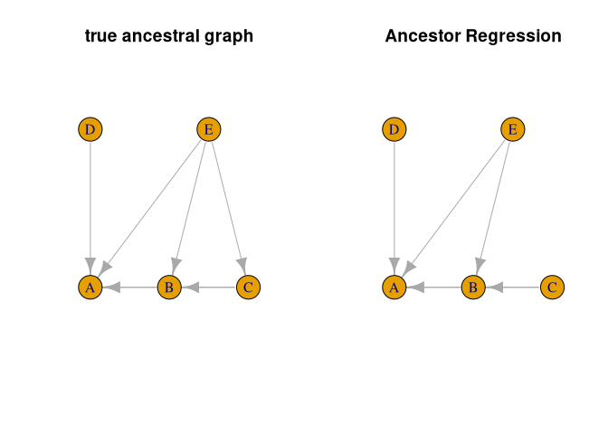
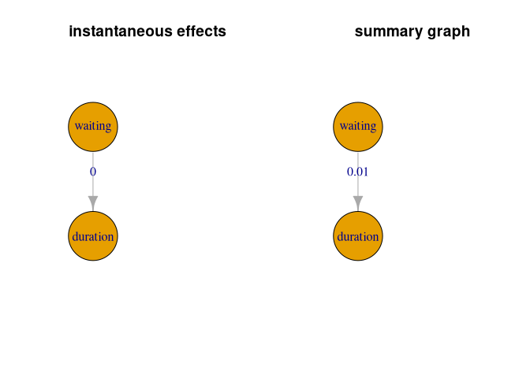

<!-- README.md is generated from README.Rmd. Please edit that file -->

# Ancestor Regression <a href="http://www.markus-ulmer.ch/AncReg/"></a>

<!-- badges: start -->

[](https://CRAN.R-project.org/package=AncReg)
[](https://github.com/markusul/AncReg/actions/workflows/R-CMD-check.yaml)

<!-- badges: end -->

Ancestor Regression (AncReg) is a package with methods to test for
ancestral connections in linear structural equation models (C.
Schultheiss and Bühlmann (2023)) and structural vector autoregressive
models (Christoph Schultheiss, Ulmer, and Bühlmann (2025)). Ancestor
Regression provides explicit error control for false causal discovery,
at least asymptotically. To have power, however, it relies on
non-Gaussian distributions.

## Installation

To install the Ancestor Regression R package from CRAN, just run

``` r
install.packages(AncReg)
```

You can install the development version of AncReg from
[GitHub](https://github.com/) with:

``` r
# install.packages("devtools")
devtools::install_github("markusul/AncReg")
```

or

``` r
# install.packages('pak')
pak::pkg_install('markusul/AncReg')
```

## linear structural equation models

This is a basic example on how to use Ancestor Regression using some
simulated data.

``` r
library(AncReg)

# random DAGS for simulation
set.seed(42)

p <- 5 #number of nodes
DAG <- pcalg::randomDAG(p, prob = 0.5)

B <- matrix(0, p, p) # represent DAG as matrix
for (i in 2:p){
  for(j in 1:(i-1)){
    # store edge weights
    B[i,j] <- max(0, DAG@edgeData@data[[paste(j,"|",i, sep="")]]$weight)
  }
}
colnames(B) <- rownames(B) <- LETTERS[1:p]

# solution in terms of noise
Bprime <- MASS::ginv(diag(p) - B)

n <- 5000
N <- matrix(rexp(n * p), ncol = p)
X <- t(Bprime %*% t(N))
colnames(X) <- LETTERS[1:p]

# fit Ancestor Regression
fit <- AncReg(X)
#> Registered S3 method overwritten by 'quantmod':
#>   method            from
#>   as.zoo.data.frame zoo
fit
#> $z.val
#>          A.0        B.0        C.0        D.0        E.0
#> A 48.7380204  0.2228364 -0.8016602  0.5490716 -0.4341680
#> B -5.3286343 59.1036440 -1.2511824 -1.2682775  0.4165155
#> C -4.5000966 -8.4766371 53.2254962  0.1683882  1.9111938
#> D -5.0924716 -0.8902521 -1.0268923 75.1415659  0.8641796
#> E -0.2529153 -3.8052342 -1.0547642  1.8153614 61.9014974
#> 
#> $p.val
#>            A.0          B.0       C.0        D.0        E.0
#> A 0.000000e+00 8.236628e-01 0.4227496 0.58295633 0.66416645
#> B 9.895400e-08 0.000000e+00 0.2108679 0.20469888 0.67703283
#> C 6.792260e-06 2.317966e-17 0.0000000 0.86627792 0.05597968
#> D 3.534257e-07 3.733305e-01 0.3044712 0.00000000 0.38748922
#> E 8.003337e-01 1.416701e-04 0.2915332 0.06946839 0.00000000
#> 
#> attr(,"class")
#> [1] "AncReg"
```

The summary function can be used to collect and organize the p-values.
Additionally it returns estimated ancestral graphs.

``` r
# collect ancestral p-values and graph
res <- summary(fit)
res
#> $p.val
#>              A            B         C          D          E
#> A 1.000000e+00 8.236628e-01 0.4227496 0.58295633 0.66416645
#> B 9.895400e-08 1.000000e+00 0.2108679 0.20469888 0.67703283
#> C 6.792260e-06 2.317966e-17 1.0000000 0.86627792 0.05597968
#> D 3.534257e-07 3.733305e-01 0.3044712 1.00000000 0.38748922
#> E 8.003337e-01 1.416701e-04 0.2915332 0.06946839 1.00000000
#> 
#> $graph
#>       A     B     C     D     E
#> A FALSE FALSE FALSE FALSE FALSE
#> B  TRUE FALSE FALSE FALSE FALSE
#> C  TRUE  TRUE FALSE FALSE FALSE
#> D  TRUE FALSE FALSE FALSE FALSE
#> E  TRUE  TRUE FALSE FALSE FALSE
#> 
#> $alpha
#> [1] 0.05
#> 
#> attr(,"class")
#> [1] "summary.AncReg"
```

As we know the truth in the simulated model, we can compare the
estimated ancestral graph with the true one.

``` r
#compare true and estimated ancestral graph
trueGraph <- igraph::graph_from_adjacency_matrix(recAncestor(B != 0))
ancGraph <- igraph::graph_from_adjacency_matrix(res$graph)

#same layout for both graphs
l <- igraph::layout_as_tree(trueGraph) 

par(mfrow = c(1, 2))
plot(trueGraph, main = 'true ancestral graph', vertex.size = 30, layout = l)
plot(ancGraph, main = 'Ancestor Regression', vertex.size = 30, layout = l)
```



## structural vector autoregressive models

We show an example of a SVAR application using the time series of geyser
eruptions. (Christoph Schultheiss, Ulmer, and Bühlmann (2025))

``` r
geyser <- MASS::geyser
# shift waiting such that it is waiting after erruption
geyser2 <- data.frame(waiting = geyser$waiting[-1], duration = geyser$duration[-nrow(geyser)])

# fit ancestor regression with 6 lags considered
fit2 <- AncReg(as.matrix(geyser2), degree = 6)
res2 <- summary(fit2)
res2
#> $inst.p.val
#>            waiting     duration
#> waiting  1.0000000 0.0004811719
#> duration 0.5109396 1.0000000000
#> 
#> $inst.graph
#>          waiting duration
#> waiting    FALSE     TRUE
#> duration   FALSE    FALSE
#> 
#> $inst.alpha
#> [1] 0.05
#> 
#> $sum.p.val
#>            waiting    duration
#> waiting  1.0000000 0.008733271
#> duration 0.1760936 1.000000000
#> 
#> $sum.graph
#>          waiting duration
#> waiting    FALSE     TRUE
#> duration   FALSE    FALSE
#> 
#> attr(,"class")
#> [1] "summary.AncReg"

par(mfrow = c(1, 2))

# visualize instantaneous ancestry
instGraph <- igraph::graph_from_adjacency_matrix(res2$inst.graph)
l <- igraph::layout_as_tree(instGraph) 
plot(instGraph, edge.label = round(diag(res2$inst.p.val[1:2, 2:1]), 2), 
     main = 'instantaneous effects', vertex.size = 90, layout = l)

# visualize summary of lagged ancestry
sumGraph <- igraph::graph_from_adjacency_matrix(res2$sum.graph)
plot(sumGraph, edge.label = round(diag(res2$sum.p.val[1:2, 2:1]), 2), 
     main = 'summary graph', vertex.size = 90, layout = l)
```



<div id="refs" class="references csl-bib-body hanging-indent"
entry-spacing="0">

<div id="ref-ancestor" class="csl-entry">

Schultheiss, C, and P Bühlmann. 2023. “Ancestor Regression in Linear
Structural Equation Models.” *Biometrika* 110 (4): 1117–24.
<https://doi.org/10.1093/biomet/asad008>.

</div>

<div id="ref-schultheiss2024ancestorregressionstructuralvector"
class="csl-entry">

Schultheiss, Christoph, Markus Ulmer, and Peter Bühlmann. 2025. *Journal
of Causal Inference*. <https://doi.org/10.1515/jci-2024-0011>.

</div>

</div>
