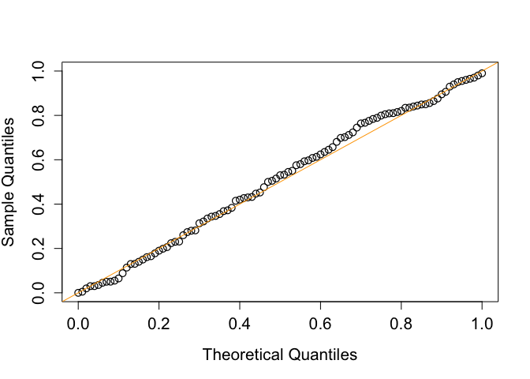

<!-- README.md is generated from README.Rmd. Please edit that file -->

# Adaptive Bootstrap Inference for Mediation Analysis (abima)

<!-- badges: start -->
<!-- badges: end -->

The goal of abima is to assess whether and how a specific continuous or
categorical exposure affects the outcome of interest through one- or
multi-dimensional mediators using an adaptive bootstrap (AB) approach.
The AB method allows to make inference for composite null hypotheses of
no mediation effect, providing valid type I error control and thus
optimizes statistical power. For more technical details, refer to He,
Y., Song, P. X. K., and Xu, G. (2023), “Adaptive bootstrap tests for
composite null hypotheses in the mediation pathway analysis,” Journal of
the Royal Statistical Society Series B: Statistical Methodology,
qkad129. <https://doi.org/10.1093/jrsssb/qkad129>.

## Installation

Install the R CRAN version of abima like so:

``` r
install.packages("abima")
```

or install the development version of abima like so:

``` r
# Install abima from GitHub:
devtools::install_github("canyi-chen/abima")
```

## Example 1

This is a single example that shows steps of using the adaptive
bootstrap (AB) to test for the null hypothesis of no mediation effect
under the linear structral equation models.

### One-dimensional mediator

``` r
library(abima)


## Set up parameters
alpha_S <- beta_M <- 1/6

set.seed(2)
data <- generate_all_data(
  n = 200,
  alpha_S = alpha_S,
  beta_M = beta_M
)
S <- data$S
M <- data$M
Y <- data$Y
X <- data$X

abYlm.Mlm(
  S,
  M,
  Y,
  X,
  B = 199
)
#> $NIE
#> [1] 0.03081102
#> 
#> $p_value_NIE
#> [1] 0.01507538
#> 
#> $NDE
#> [1] 1.034168
#> 
#> $p_value_NDE
#> [1] 2.535113e-31
#> 
#> $NTE
#> [1] 1.064979
#> 
#> $p_value_NTE
#> [1] 7.724359e-34
#> 
#> attr(,"class")
#> [1] "abYlmMlmResult"
```

### Two-dimensional vector of mediators

``` r
library(abima)


## Set up parameters
alpha_S <- beta_M <- rep(1/6, 2)

set.seed(2)
data <- generate_all_data(
  n = 200,
  alpha_S = alpha_S,
  beta_M = beta_M
)
S <- data$S
M <- data$M
Y <- data$Y
X <- data$X

abYlm.Mlm(
  S,
  M,
  Y,
  X,
  B = 199
)
#> $NIE
#> [1] 0.03820384
#> 
#> $p_value_NIE
#> [1] 0.005025126
#> 
#> $NDE
#> [1] 1.072573
#> 
#> $p_value_NDE
#> [1] 2.063533e-33
#> 
#> $NTE
#> [1] 1.110776
#> 
#> $p_value_NTE
#> [1] 2.829119e-37
#> 
#> attr(,"class")
#> [1] "abYlmMlmResult"
```

## Example 2

This example shows the use of abYlm.Mglm function with confounders
covariates_cfder being included in the mediation analysis.

``` r
library(abima)


## Set up parameters
M.family <- poisson()
alpha_S <- beta_M <- 1/15

set.seed(2)
data <- generate_all_data(
  n = 200,
  alpha_S = alpha_S,
  beta_M = beta_M,
  M.family = M.family
)
S <- data$S
M <- data$M
Y <- data$Y
X <- data$X

abYlm.Mglm(
  S,
  M,
  Y,
  X,
  M.family = M.family,
  B = 199
)
#> $NIE
#> [1] 0.02642484
#> 
#> $p_value_NIE
#> [1] 0.01005025
#> 
#> $NDE
#> [1] 1.016851
#> 
#> $p_value_NDE
#> [1] 4.579245e-32
#> 
#> $NTE
#> [1] 1.043276
#> 
#> $p_value_NTE
#> [1] 0
#> 
#> attr(,"class")
#> [1] "abYlmMglmResult"

abYlm.Mglm(
  S,
  M,
  Y,
  X,
  covariates_cfder = colMeans(X), # the covariates_cfder that you would to condition on
  M.family = M.family,
  B = 199
)
#> $NIE
#> [1] 0.03110028
#> 
#> $p_value_NIE
#> [1] 0.01005025
#> 
#> $NDE
#> [1] 1.016851
#> 
#> $p_value_NDE
#> [1] 4.579245e-32
#> 
#> $NTE
#> [1] 1.047951
#> 
#> $p_value_NTE
#> [1] 0
#> 
#> attr(,"class")
#> [1] "abYlmMglmResult"
```

## Example 3

This exmaple shows that the performance of adaptive bootstrap test in
the type I error control under the composite null hypothesis.

``` r
## Load libraries
library(abima)

if (rlang::is_installed("future.apply")) {
  library(future.apply)
  plan(multisession, workers = 12)
} else {
  install.packages("future.apply")
  library(future.apply)
  plan(multisession, workers = 12)
}
#> Loading required package: future


## Set up parameters
M.family <- gaussian()
Y.family <- gaussian()

simulation <- function(alpha_S = 0, beta_M = 0) {
  data <- generate_all_data(
    n = 500,
    alpha_S = alpha_S,
    beta_M = beta_M,
    M.family = M.family,
    Y.family = Y.family
  )
  S <- data$S
  M <- data$M
  Y <- data$Y
  X <- data$X

  out <- abYlm.Mlm(
    S,
    M,
    Y,
    X,
    B = 199
  )
  out
}


## Empirical distribution of the p value
# the number of replication for approximating the distribution of the p value
Nreps <- 200
alpha_S <- beta_M <- 0
output <- future_replicate(Nreps, simulation(0, 0))


plot(
  seq(0, 1, 0.01),
  quantile(unlist(output[2,]), probs = seq(0, 1, 0.01)),
  pch = 1,
  cex = 1.2,
  cex.lab = 1.3,
  cex.axis = 1.3,
  ylab = "Sample Quantiles",
  xlab = "Theoretical Quantiles",
  type = "p",
  xlim = c(0, 1),
  ylim = c(0, 1),
  lwd = 1.2
)
abline(0, 1, col = "orange")
```


