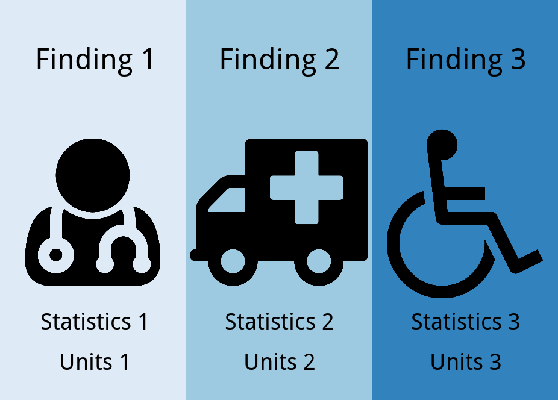

```{r setup, include = FALSE}
knitr::opts_chunk$set(
  collapse = TRUE,
  comment = "#>"
)
```


# Overview
A visual abstract is a great companion to help publicize your study. They are particularly efficient at communicating your main findings at a high level. For more information, the interested reader is directed [here.](https://static1.squarespace.com/static/5854aaa044024321a353bb0d/t/5a527aa89140b76bbfb2028a/1515354827682/VisualAbstract_Primer_v4_1.pdf)

The purpose of this vignette is to demonstrate how to create customized visual abstracts from scratch, recognizing the shiny application included in `abstractr` package has certain restraints by design.

# Requirements
To get started, you will need to install and load a few packages:

```{r}
library(ggplot2)
library(gridExtra)
library(emojifont)
```

# A Blank Canvas
We’ll start with a blank canvas. This will provide a useful point of reference for positioning text and graphics of the visual abstract.

Using `theme_linedraw()` on our canvas allows us to visualize the coordinate system to this end.

```{r fig.width=7, fig.height=4}
canvas <- ggplot(data=data.frame(x=1:10, y=1:10), aes(x=x, y=y))   +
          scale_y_continuous(limits=c(1,10), breaks=seq(1,10,0.5)) +
          scale_x_continuous(limits=c(1,10), breaks=seq(1,10,0.5)) +
          theme_linedraw()

canvas
```

# Panels
One approach to build a visual abstract is to do so on a panel-by-panel basis. The canvas we created serves as a starting point and we’ll use it to build the first panel.

Let’s remove all existing plot features and color the panel.

```{r fig.width=7, fig.height=4}
panel1 <- canvas + 
          theme_void() + 
          theme(panel.background = element_rect(fill = '#DEEBF7', colour = '#DEEBF7'))

panel1
```

This process can be repeated for additional panels and ensures consistency in size of panels so layouts are neat.

For the remaining 2 panels, let’s choose different colors.

```{r}
panel2 <- canvas + 
          theme_void() + 
          theme(panel.background = element_rect(fill = '#9ECAE1', colour = '#9ECAE1'))

panel3 <- canvas + 
          theme_void() + 
          theme(panel.background = element_rect(fill = '#3182BD', colour = '#3182BD'))
```

# Layouts
Arranging your panels into a coherent visual abstract is accomplished by `grid.arrange()`.

Using this function, you can specify any configuration you desire for your individual panels. Since we have 3 panels to work with, I can arrange them in columns like so:

```{r fig.width=7, fig.height=4}
grid.arrange(panel1,panel2,panel3, ncol=3)
```

The shiny app included in the package is restricted to a column-based layout. If you wish for an alternate layout, you can specify it (or combinations) using `grid.arrange()`. For example, for a *row* based layout:

```{r fig.width=7, fig.height=4}
grid.arrange(panel1,panel2,panel3, nrow=3)
```

# Content
Now that we have some panels and a layout in mind, let’s start adding content to individual panels.

## Text
Text can be added to a panel using the `annotate()` function.

We can position the text using the x and y coordinates of our canvas. We can also change text attributes like size, fontface and color.

```{r fig.width=7, fig.height=4}
panel1 <- canvas + 
          theme_void() + 
          theme(panel.background = element_rect(fill = '#DEEBF7', colour = '#DEEBF7')) +
          annotate("text", x=5.5, y=9,   label = "Finding 1",    size=15, fontface=2) +
          annotate("text", x=5.5, y=2.5, label = "Statistics 1", size=12, fontface=2) +
          annotate("text", x=5.5, y=1.5, label = "Units 1",      size=12, fontface=2)
  
panel1
```

## Icons
Icons can be added to the panel using the `geom_text()` function.

Icons are provided by Font Awesome, which are free to use and redistribute. You can view the complete library of icons [here.](https://fontawesome.com/v4.7.0/icons/)

Let’s use the user-md icon as a demonstration.

```{r fig.width=7, fig.height=4}
panel1 <- canvas + 
          theme_void() + 
          theme(panel.background = element_rect(fill = '#DEEBF7', colour = '#DEEBF7')) +
          geom_text(family='fontawesome-webfont', label=fontawesome('fa-user-md'), 
                    x=5.5, y=5.5, size=75)


```


**Note:** If you are using RStudio on Windows, you may have to call a new *X11* Window before viewing or the icon might not appear.

```{r eval=FALSE}
panel1 <- canvas + 
          theme_void() + 
          theme(panel.background = element_rect(fill = '#DEEBF7', colour = '#DEEBF7')) +
          geom_text(family='fontawesome-webfont', label=fontawesome('fa-user-md'), 
                    x=5.5, y=5.5, size=75)

X11()

#panel1
```


## Troubleshooting Positioning

If you want to get an idea of how to set your coordinates, you can simply run a panel without theme_void(). This will render the panel with grid lines.

```{r fig.width=7, fig.height=4}
panel1 <- canvas + 
          theme(panel.background = element_rect(fill = '#DEEBF7', colour = '#DEEBF7')) +
          annotate("text", x=5.5, y=9,   label = "Finding 1",    size=15, fontface=2) +
          annotate("text", x=5.5, y=2.5, label = "Statistics 1", size=12, fontface=2) +
          annotate("text", x=5.5, y=1.5, label = "Units 1",      size=12, fontface=2)
  
panel1
```

You can now clearly see the coordinates specified for the text. This is a useful way for troubleshooting positioning, especially if you change font sizes or want a customized layout. This technique also works for checking the positioning of icons.

# Putting It All Together
At this point, you have everything you need to create a visual abstract for your study.

Let’s put things together to see how they work. The code below is a completely self-contained example - feel free to use it as a template.

```{r fig.width=7, fig.height=4}
#Canvas
canvas <- ggplot(data=data.frame(x=1:10, y=1:10), aes(x=x, y=y))   +
          scale_y_continuous(limits=c(1,10), breaks=seq(1,10,0.5)) +
          scale_x_continuous(limits=c(1,10), breaks=seq(1,10,0.5)) +
          theme_linedraw()

#Create individual panels
panel1 <- canvas + 
          theme_void() + 
          theme(panel.background = element_rect(fill = '#DEEBF7', colour = '#DEEBF7')) +
          geom_text(family='fontawesome-webfont', label=fontawesome('fa-user-md'), 
                    x=5.5, y=5.5, size=75) +
          annotate("text", x=5.5, y=9,   label = "Finding 1",    size=13, fontface=2) +
          annotate("text", x=5.5, y=2.5, label = "Statistics 1", size=10, fontface=2) +
          annotate("text", x=5.5, y=1.5, label = "Units 1",      size=10, fontface=2) 

panel2 <- canvas + 
          theme_void() + 
          theme(panel.background = element_rect(fill = '#9ECAE1', colour = '#9ECAE1')) +
          geom_text(family='fontawesome-webfont', label=fontawesome('fa-ambulance'), 
                    x=5.5, y=5.5, size=75) +
          annotate("text", x=5.5, y=9,   label = "Finding 2",    size=13, fontface=2) +
          annotate("text", x=5.5, y=2.5, label = "Statistics 2", size=10, fontface=2) +
          annotate("text", x=5.5, y=1.5, label = "Units 2",      size=10, fontface=2)

panel3 <- canvas + 
          theme_void() + 
          theme(panel.background = element_rect(fill = '#3182BD', colour = '#3182BD')) +
          geom_text(family='fontawesome-webfont', label=fontawesome('fa-wheelchair'), 
                   x=5.5, y=5.5, size=75) +
          annotate("text", x=5.5, y=9,   label = "Finding 3",    size=13, fontface=2) +
          annotate("text", x=5.5, y=2.5, label = "Statistics 3", size=10, fontface=2) +
          annotate("text", x=5.5, y=1.5, label = "Units 3",      size=10, fontface=2) 

#Arrange individual panels 
#grid.arrange(panel1, panel2, panel3, ncol=3)
```


If you wish to include headers and footers for your visual abstract, you can create them like you did using the canvas and include them in the layout.

