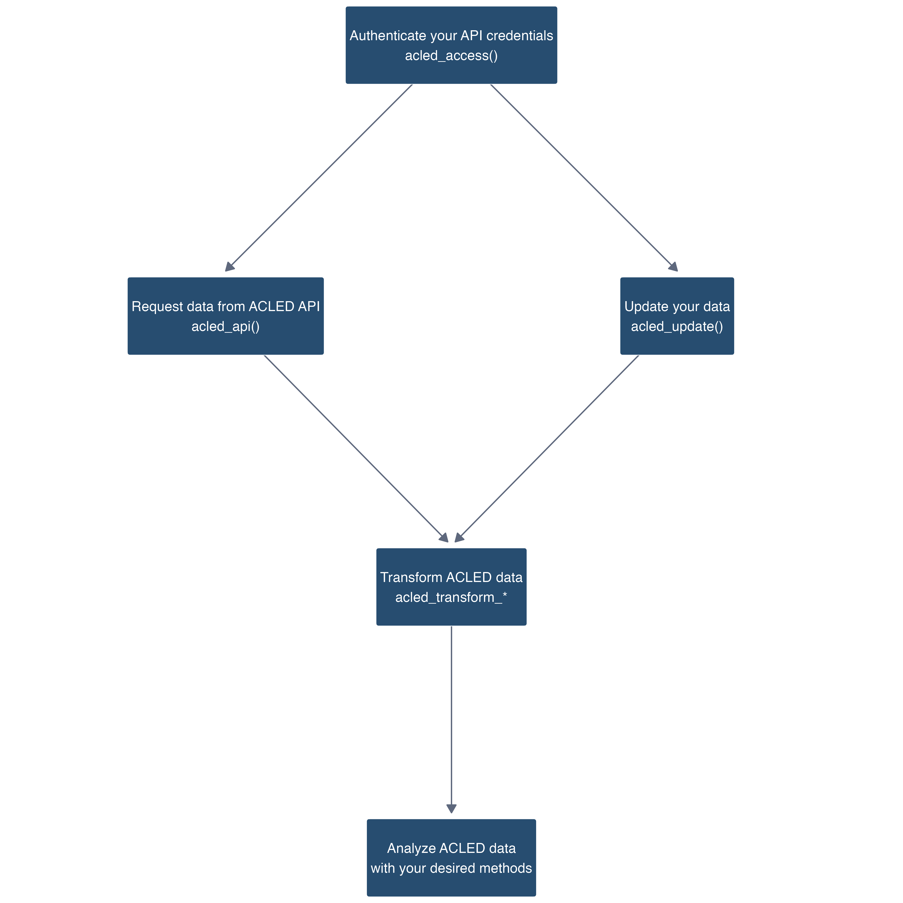

```{r, include = FALSE}
knitr::opts_chunk$set(
  collapse = TRUE,
  comment = "#>"
)
```

``` {r, echo=FALSE,include = FALSE}
library(acledR)
library(dplyr)
```

This vignette provides a brief overview of the acledR package. You can find more detailed explanations and examples under the 'Using acledR' tab. For general information on ACLED’s methodology, please visit [ACLED's Knowledge Base](https://acleddata.com/knowledge-base/). 

The main objectives of this package are:

1. Facilitating access to ACLED data via ACLED's API
2. Simplifying the manipulation of ACLED data

This package was designed with the following workflow in mind:

<!--  -->
```{r, out.width = "500px", echo = FALSE}

```

You can begin by installing and then loading the package:

```{r, eval=FALSE}
# Install acledR
install.packages("acledR") # from CRAN

devtools::install_github("ACLED/acledR") # or from github.

# Load acledR
library(acledR)
```

## Authenticating your credentials - `acled_access()`

ACLED API access requires an API key for authentication. To register for API access, please visit ACLED's Access Portal [here](https://developer.acleddata.com/). You can also find a detailed guide on creating your account and obtaining your API key in [ACLED's Access Guide](https://acleddata.com/acleddatanew//wp-content/uploads/2021/11/ACLED_Access-Guide_October-2020.pdf).

Once you are registered, we encourage authenticating your credentials using the `acled_access()` function. Using this function both ensures that your credentials are working as intended and saves them in your R environment, eliminating the need for repeated authentication with each API request.

```{r, eval=FALSE}
acled_access(email = "email@example.com", key = "your_key") #  This is an example, you will need to input your credentials.
```


If the authentication was successful, you will find a message in the console stating that your credentials were authorized.

## Requesting data from ACLED’s API - `acled_api()`

After authenticating your credentials, you can request data from the API using the `acled_api()` function. This function accepts several fields for filtering and formatting ACLED data. As a running example, let's request all events in Argentina throughout 2022:

```{r, eval=FALSE}
argentinian_data <- acled_api(
  # Country of interest
  country = "Argentina",
  # Earliest date for requested events
  start_date ="2022-01-01",
  # Last date for requested events
  end_date = "2022-12-31",
  # Request 'inter codes' in numeric rather than text form
  inter_numeric = TRUE,
  # Turn off acled_api() interactive prompt
  prompt = FALSE
  )
```


Note that while this example uses only five arguments (`country`, `start_date`, `end_date`, `inter_numeric`, and `prompt`), `acled_api()` accepts several other useful arguments, descriptions of which can be found in `vignette("acled_api")`. If you do not use the `acled_access` function to store your credentials, you will also need to specify your email and API key in each request.

The `acled_api()` function does not place constraints on the amount of data requested. As a result, users are able to make potentially very large requests (e.g. events for all countries and years at once) which might strain ACLED's API. For performance reasons, `acled_api()` breaks large requests into multiple smaller requests. You can find more about how `acled_api()` subsets requests by visiting in the `acled_api()` vignette.


## Updating ACLED Data - `acled_update()`

ACLED data are regularly updated. You can ensure that your own dataset remains current by using the `acled_update()` function. `acled_update()` is designed to handle the intricacies of updating your ACLED dataset, accounting for new events, modifications to existing events, and event deletions.

To update your dataset, provide the `acled_update` function a dataframe of your old dataset. Note that there are other options providing more control over how your dataset is updated, more information for which can be found in the `vignette("acled_update")`.

Here is an example of how you can use `acled_update()` to update an old dataset:

```{r, eval = FALSE}
new_data <- acled_update(acledR::acled_old_deletion_dummy, 
                         inter_numeric = TRUE,
                         prompts = FALSE)
```

## Transforming ACLED Data - `acled_transform_*`

ACLED data has a unique structure which can complicate data manipulation. The `acledR` package provides a suite of functions to simplify this process. You can find a more in-depth treatment of ACLED’s data transformation functions by visiting the `vignette("acled_transformations")`.

### 1. Reshaping Data: Wide to Long Format - `acled_transform_longer()`

The `acled_transform_longer()` function transforms ACLED data from a wide format, where multiple actors are represented in each row, to a long format, with separate rows for each actor. This is particularly useful for actor-based analyses.

```{r}
long_data <- acled_transform_longer(acledR::acled_old_dummy, type = "full_actors")

head(long_data)
```

You can specify the type of transformation using the type argument, choosing from `full_actors`, `main_actors`, `assoc_actors`, or `source`. For instance, specifying `full_actors` will result in you transforming the data frame such that every actor and associate actor for a given event is represented in a separate row. This function provides flexibility and control over the transformation process, allowing you to tailor the data structure to your specific needs.

### 2. Reshaping Data: Long to Wide Format - `acled_transform_wider()`

Conversely, the `acled_transform_wider()` function enables you to pivot your data back to a wide format. This function may be useful if you used `acled_transform_longer()` and wish to revert to the original data structure.

```{r}
wide_data <- acled_transform_wider(long_data, type = "full_actors")

head(wide_data)
```

Like its counterpart, this function requires the data and type arguments.

### 3. Converting Interaction Codes - `acled_transform_interaction()`

The `acled_transform_interaction()` function allows you to convert between numeric and text interaction codes, facilitating easier interpretation and analysis of ACLED data. The function requires your ACLED dataset and an optional boolean argument `only_inters`, which determines whether to include only `inter1` and `inter2` columns or also the `interaction` column in the output. By default, `only_inters` is set to `FALSE`. Note further that the `acled_api()` function returns interaction codes as text strings by default, making this function most useful when the original API call included the parameter value `inter_numeric = TRUE`, as in the running example.

```{r}
transformed_data <- acled_transform_interaction(acledR::acled_old_dummy)

# Note the inter1 and inter2 columns
head(transformed_data)
```

----


