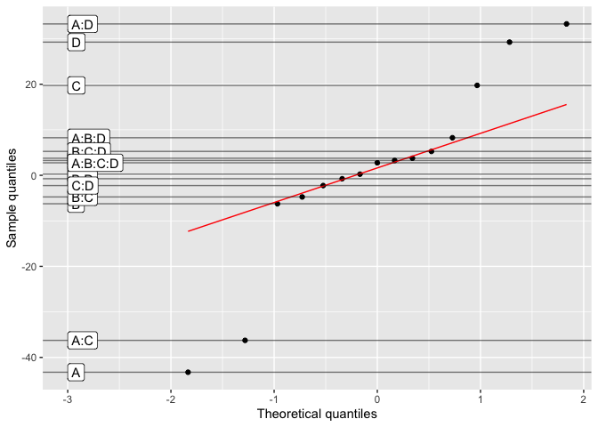
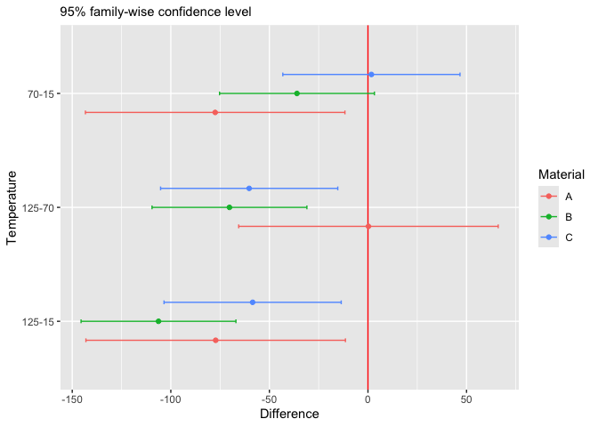
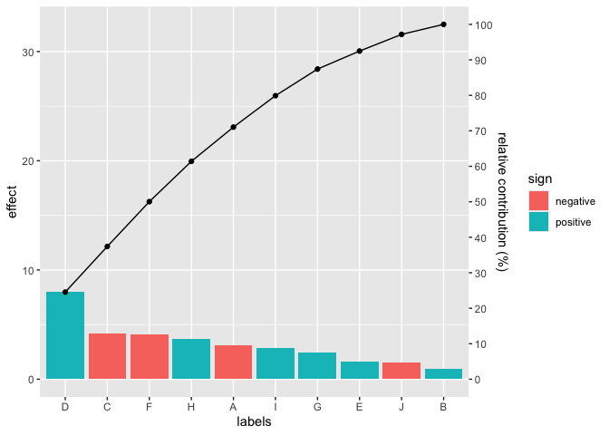

<!-- README.md is generated from README.Rmd. Please edit that file -->

# adas.utils

<!-- badges: start -->

<!-- badges: end -->

The goal of adas.utils is to provide some utility functions to be used
in the course *Analysis of Data and Statistics* at the University of
Trento, Italy. Course contents are on
<https://paolobosetti.quarto.pub/ADAS/>.

## Installation

You can install the development version of adas.utils from
[GitHub](https://github.com/pbosetti/adas.utils) with:

``` r
# install.packages("devtools")
devtools::install_github("pbosetti/adas.utils", build_vignettes = TRUE)
```

## Examples

### Loading data sets

On <https://paolobosetti.quarto.pub/data.html> there are a list of
example datasets to be used during the course. You can load them with
the `examples_url` function:

``` r
examples_url("battery.dat") |> read.table(header=T) |> head()
#>   RunOrder StandardOrder Temperature Material Repeat Response
#> 1       34             1          15        1      1      130
#> 2       25             2          70        1      1       34
#> 3       16             3         125        1      1       20
#> 4        7             4          15        2      1      150
#> 5        8             5          70        2      1      136
#> 6        1             6         125        2      1       25
```

### Chauvenet’s criterion

The Chauvenet’s criterion is a method to identify possible outliers in a
sample. Here is an example:

``` r
x <- rnorm(100)
x[50] <- 10
chauvenet(x)
#> Chauvenet's criterion for sample x
#> Suspect outlier: 50, value 10
#> Decision: reject it
```

### Daniel’s plot

Daniel’s plot is a QQ plot of the effects of a non-replicated factorial
model. Here is an example:

``` r
daniel_plot_qq(lm(Y~A*B*C*D, data=filtration))
```

 \###
Tukey’s test plot

The `stats::TukeyHSD` function in base R provides a way to perform
multiple comparisons of means. It can print the results in tabular form
or can be plotted with the `plot` method:

``` r
library(tidyverse)
examples_url("battery.dat") %>%
  read_table() %>%
  mutate(across(c(Temperature, Material), factor)) %>%
  mutate(Material = LETTERS[Material]) %>% 
  ggTukey(Response~Temperature, splt=~Material)
```



### Pareto chart

The `pareto_chart` function is a generic function that creates a Pareto
chart either from a general data frame or from the effects of a `lm`
object. Here is an example:

``` r
library(tidyverse)
set.seed(1)
tibble(
  val=rnorm(10, sd=5),
  cat=LETTERS[1:length(val)]
  ) %>%
  pareto_chart(labels=cat, values=val)
```



``` r

# For a linear model:
pareto_chart(lm(Y~A*B*C*D, data=filtration))
```


### Design of Experiments

There is a host of functions to be used in the context of Design of
Experiments. Here is an example to prepare a design matrix for a
$2^{5-2}$ fractional factorial plan:

``` r
fp_design_matrix(5) %>% 
  fp_fraction(~A*B*C*D) %>% 
  fp_fraction(~B*C*D*E)
#>  Factorial Plan Design Matrix
#>  Defining Relationship:  ~ A * B * C * D * E 
#>  Factors:  A B C D E 
#>  Levels:  -1 1 
#>  Fraction:  I=ABCD I=BCDE 
#>  Type:  fractional 
#>  
#> # A tibble: 8 × 12
#>   StdOrder RunOrder .treat  .rep     A     B     C     D     E Y      ABCD  BCDE
#>      <int>    <int> <chr>  <int> <dbl> <dbl> <dbl> <dbl> <dbl> <lgl> <dbl> <dbl>
#> 1        1        9 (1)        1    -1    -1    -1    -1    -1 NA        1     1
#> 2        7       14 bc         1    -1     1     1    -1    -1 NA        1     1
#> 3       11       10 bd         1    -1     1    -1     1    -1 NA        1     1
#> 4       13       31 cd         1    -1    -1     1     1    -1 NA        1     1
#> 5       20        4 abe        1     1     1    -1    -1     1 NA        1     1
#> 6       22       13 ace        1     1    -1     1    -1     1 NA        1     1
#> 7       26       26 ade        1     1    -1    -1     1     1 NA        1     1
#> 8       32       24 abcde      1     1     1     1     1     1 NA        1     1
```

You can also prepare a design matrix for a $2^n$ full factorial plan,
and later on augment it with a central point and then to a central
composite design with axial points:

``` r
fp_design_matrix(3, rep=2) %>% 
  fp_augment_center(rep=5) %>% 
  fp_augment_axial(rep=2)
#>  Factorial Plan Design Matrix
#>  Defining Relationship:  ~ A * B * C 
#>  Factors:  A B C 
#>  Levels:  -1 1 
#>  Fraction:  NA 
#>  Type:  composite 
#>  
#> # A tibble: 45 × 8
#>    StdOrder RunOrder .treat  .rep     A     B     C Y    
#>       <int>    <int> <chr>  <int> <dbl> <dbl> <dbl> <lgl>
#>  1        1       10 (1)        1    -1    -1    -1 NA   
#>  2        2        7 a          1     1    -1    -1 NA   
#>  3        3        3 b          1    -1     1    -1 NA   
#>  4        4       16 ab         1     1     1    -1 NA   
#>  5        5        6 c          1    -1    -1     1 NA   
#>  6        6        8 ac         1     1    -1     1 NA   
#>  7        7        2 bc         1    -1     1     1 NA   
#>  8        8       13 abc        1     1     1     1 NA   
#>  9        9       12 (1)        2    -1    -1    -1 NA   
#> 10       10       11 a          2     1    -1    -1 NA   
#> # ℹ 35 more rows
```

# Author

Paolo Bosetti, University of Trento
