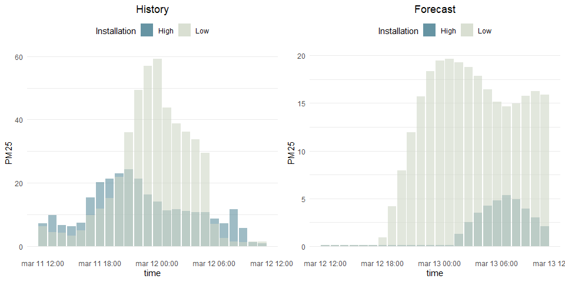
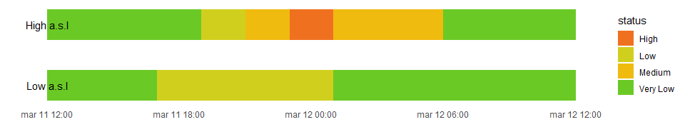

# aiRly 

<!-- badges: start -->

[](https://travis-ci.org/piotrekjanus/aiRly)
[](https://ci.appveyor.com/project/piotrekjanus/aiRly)
[](https://codecov.io/gh/piotrekjanus/aiRly?branch=master)
[](https://www.tidyverse.org/lifecycle/#maturing)
<!-- badges: end -->

aiRly is an unofficial R wrapper for [Airly](https://airly.eu/),
platform which mission is to monitor and inform millions of people about
the current state of air quality.

## Installation

You can install current development version of aiRly from
[GitHub](https://github.com/) with:

``` r
devtools::install_github("piotrekjanus/aiRly")
```

## Set developer account

First, you should start with setting your Airly developer account at
[Airly developer](https://developer.airly.eu/). After you receive key,
we can check air condition\!

## Example

This is a basic example of package usage.

Let’s find out if there are any near stations somewhere in Krakow,
Poland. We will look for stations in a range of 20 km. We set
`max_results` to -1 in order to get all stations in the neighborhood.

``` r
library(aiRly)

api_key <- Sys.getenv("api_key")
aiRly::set_apikey(api_key)

stations <- get_nearest_installations(50.11670, 19.91429, max_distance = 20, max_results = -1)
```

Let’s filter only for Airly stations and choose those which are located
at the highest and lowest point a.s.l.

``` r
minmax_station <- stations %>%
                    filter(is_airly) %>% 
                    summarize(min_elevation_id = id[which.min(elevation)], 
                              max_elevation_id = id[which.max(elevation)])

h_station <- get_installation_measurements(minmax_station$max_elevation_id)
l_station <- get_installation_measurements(minmax_station$min_elevation_id)
```

Ok, we have just received information about `current` state, last `24h
history` and `forecasts` for next day for both installations.

Let’s make some visualizations

``` r
library(ggplot2)
library(gridExtra)

g1 <- ggplot() + 
        geom_col(h_station$history, mapping = aes(x=time$from, y = measure$PM25, fill="High"),  alpha = 0.5) +
        geom_col(l_station$history, mapping = aes(x=time$from, y = measure$PM25, fill="Low"), alpha = 0.6) +
        scale_fill_manual(values=c("#40798C", "#CFD7C7")) +
        theme_minimal() +
        xlab("time") +
        ylab("PM25") +
        ggtitle("History") +
        theme(panel.grid.major.x = element_blank(),
              panel.grid.minor.x = element_blank(),
              plot.title = element_text(hjust=0.5),
              legend.position="top") +
        labs(fill="Installation")
    
g2 <- ggplot() + 
        geom_col(h_station$forecast, mapping = aes(x=time$from, y = measure$PM25, fill="High"),  alpha = 0.5) +
        geom_col(l_station$forecast, mapping = aes(x=time$from, y = measure$PM25, fill="Low"), alpha = 0.6) +
        scale_fill_manual(values=c("#40798C", "#CFD7C7")) +
        theme_minimal() +
        xlab("time") +
        ylab("PM25") +
        ggtitle("Forecast") +
        theme(panel.grid.major.x = element_blank(),
              panel.grid.minor.x = element_blank(),
              plot.title = element_text(hjust=0.5),
              legend.position="top") +
        labs(fill="Installation") 

grid.arrange(g1, g2, ncol = 2, nrow = 1)
```



We can see that most of the time, air quality is worse (and will be) in
lower part of Krakow. Ok, but are those sensors readings indicating high
pollution? We can check it using `get_indexes` function, which fill
translate values of
[AIRLY\_CAQI](https://airly.eu/en/everything-you-should-know-about-air-pollution)
variable

``` r
indexes <- get_indexes()
airly_caqi <- indexes %>% filter(name == "AIRLY_CAQI")
airly_caqi[is.na(airly_caqi)] <- Inf 

history_high <- h_station$history
history_high$status <- unlist(lapply(history_high$index$AIRLY_CAQI, 
                        function(x) airly_caqi[x >= airly_caqi$minValue & 
                                               x <= airly_caqi$maxValue, "description"]))

history_low <- l_station$history
history_low$status <- unlist(lapply(history_low$index$AIRLY_CAQI, 
                        function(x) airly_caqi[x >= airly_caqi$minValue &
                                               x <= airly_caqi$maxValue, "description"]))

ggplot() +
  geom_rect(history_high, mapping = aes(xmin=time$from, xmax = time$to, 
                                        ymin=0, ymax=.1, fill = status)) +
  geom_rect(history_low, mapping = aes(xmin=time$from, xmax = time$to, 
                                       ymin=0.2, ymax=.3, fill = status))+
  scale_fill_manual(values = c("Very Low" = "#6BC926",
                               "Low"    = "#D1CF1E",
                               "Medium" = "#EFBB0F",
                               "High"   = "#EF7120",
                               "Very High" ="#EF2A36",
                               "Extreme" = "#B00057",
                               "Airmageddon!" = "#770078")) +
  annotate("text", x = min(history_high$time$from), y = 0.25, label = "High a.s.l") +
  annotate("text", x = min(history_low$time$from), y = 0.05, label = "Low a.s.l") +
  theme_minimal() +
  theme(panel.grid = element_blank(),
        axis.text.y = element_blank()) +
  ylab("") +xlab("")
```



After we made few requests, we would like to check how many we have
left. For that purpose, simply use `remaining_requests`

``` r
rem_req <- remaining_requests()
cat("Available requests \n", rem_req$remaining, "/", rem_req$limit)
#> Available requests 
#>  79 / 100
```
