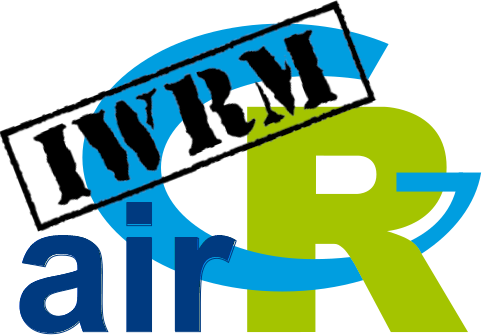
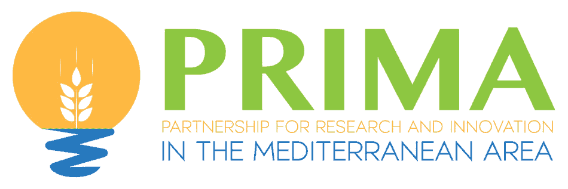

<!-- README.md is generated from README.Rmd. Please edit that file -->

# airGRiwrm: airGR based Integrated Water Resource Management Modeling 

<!-- badges: start -->

[](https://cran.r-project.org/package=airGRiwrm)
[](https://cran.r-project.org/package=airGRiwrm)
[](https://cran.r-project.org/web/licenses/AGPL-3)
[](https://doi.org/10.15454/3CVD1I)
[](https://gitlab.irstea.fr/in-wop/airGRiwrm/-/pipelines)
<!-- badges: end -->

**airGRiwrm** is an extension of the **airGR** R package for managing
semi-distributive hydrological model on an anthropized catchment.

This package is developed by the [mixed research unit G-EAU,
Montpellier, France](https://g-eau.fr/index.php/en/) and the [HYDRO team
of the INRAE HYCAR research unit, Antony,
France](https://webgr.inrae.fr/eng).

## Installation

``` r
# Install stable version from CRAN
install.packages("airGRiwrm")

# Or the development version from GitHub:
# install.packages("devtools")
devtools::install_github("inrae/airGRiwrm", "dev")
```

## Get started

Visit the website dedicated to the package at
<https://inrae.github.io/airGRiwrm/> for tutorials, usage examples and
documentation.

## Acknowledgement

This package has been developped as part of the IN-WOP European project
(2019-2023) and the Talanoa-Water PRIMA project (2021-2025).

The authors would like to thank the European Commission and the French
National Research Agency (ANR) for funding in the frame of the
collaborative international consortium
[IN-WOP](http://www.waterjpi.eu/joint-calls/joint-call-2018-waterworks-2017/booklet/in-wop)
financed under the 2018 Joint call of the WaterWorks2017 ERA-NET Cofund.
This ERA-NET is an integral part of the activities developed by the
Water JPI.

<p style="display: flex; flex-wrap: wrap; justify-content: space-around; align-items: center;">


</p>

Talanoa-Water is part of the PRIMA Programme supported by the European
Union. The PRIMA programme is supported under Horizon 2020 the European
Union’s Framework Programme for Research and Innovation. Grant Agreement
number: 2023

<p style="display: flex; justify-content: space-between;">


</p>
