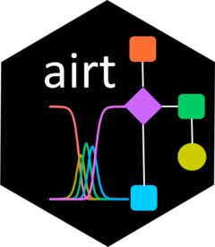
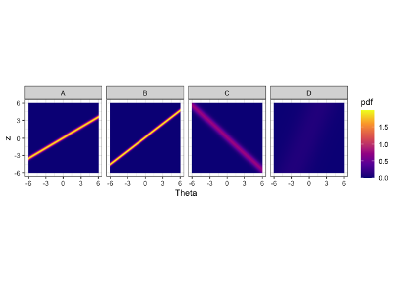
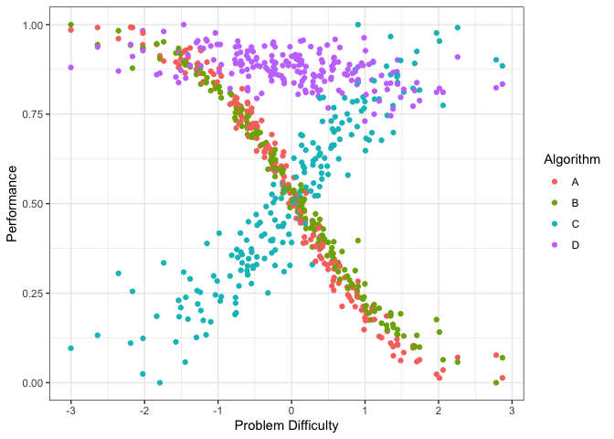
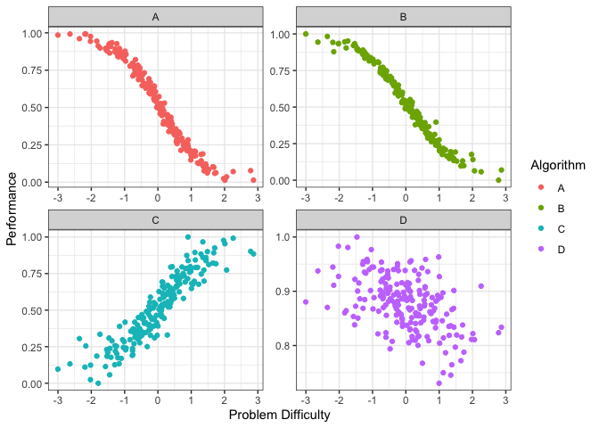
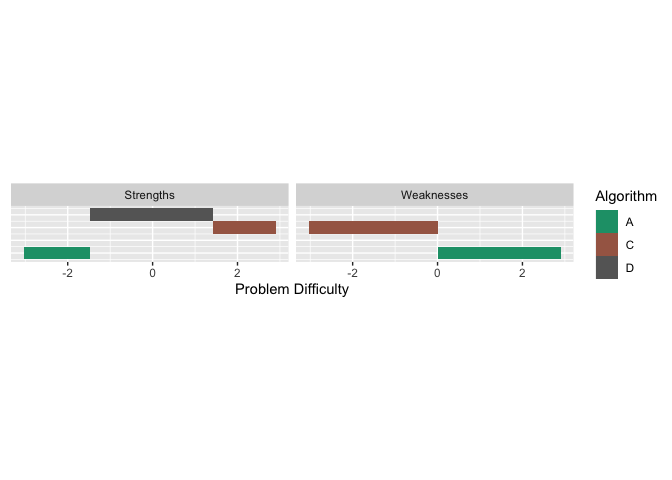
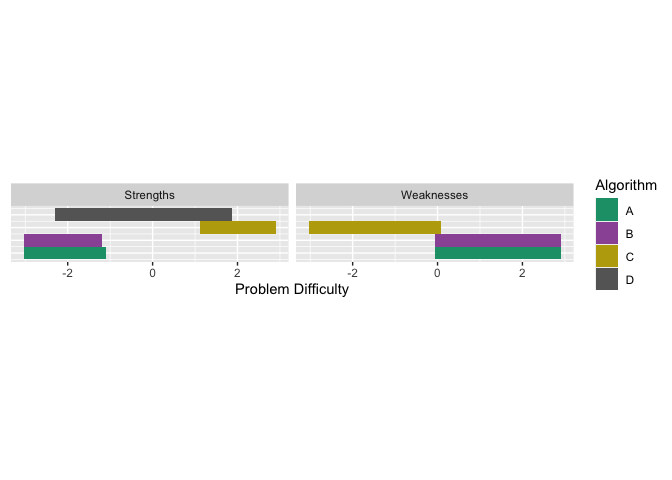
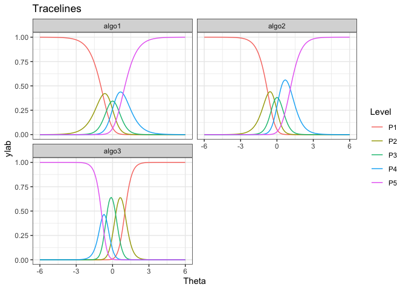

<!-- README.md is generated from README.Rmd. Please edit that file -->

# airt 

<!-- badges: start -->

[](https://github.com/sevvandi/airt/actions/workflows/R-CMD-check.yaml)
<!-- badges: end -->

The goal of *airt* is to evaluate a portfolio of algorithms using Item
Response Theory (IRT). To fit the IRT models, I have used the R packages
*mirt* and *EstCRM*. The fitting function is *EstCRM* is slightly
changed to accommodate for the algorithm evaluation setting.

## Installation

You can install the released version of airt from
[CRAN](https://CRAN.R-project.org) with:

``` r
install.packages("airt")
```

You can install the development version from
[GitHub](https://github.com/) with:

``` r
# install.packages("devtools")
devtools::install_github("sevvandi/airt")
```

## Example - Continuous Performance Data

Let us consider some synthetic performance data. For this example, I
will generate performance values for 4 algorithms that are correlated
with each other.

``` r
library(airt)
library(ggplot2)
library(gridExtra)


set.seed(1)
algo1 <- runif(200)
algo2 <- 2*algo1 + rnorm(200, mean=0, sd=0.1)
algo2 <- (algo2 - min(algo2))/(max(algo2) - min(algo2))

algo3 <- 1 - algo1 + rnorm(200, mean=0, sd=0.1)
algo3 <- (algo3 - min(algo3))/(max(algo3) - min(algo3))

algo4 <- 2 + 0.2*algo1 + rnorm(200, mean=0, sd=0.1)
algo4 <- algo4/max(algo4)


df <- cbind.data.frame(algo1, algo2, algo3, algo4)
colnames(df) <- c("A", "B", "C", "D")
head(df)
#>           A         B         C         D
#> 1 0.2655087 0.2726160 0.7842857 0.8640853
#> 2 0.3721239 0.3988125 0.5474863 0.8573372
#> 3 0.5728534 0.5370545 0.6271255 0.8370052
#> 4 0.9082078 0.8881757 0.1776022 0.9152130
#> 5 0.2016819 0.2134300 0.8944309 0.8970685
#> 6 0.8983897 0.9519739 0.3346240 0.9807495
```

This dataframe gives the performances of algorithms A, B, C and D. Each
row is an dataset/instance and each column denotes an algorithm. Let us
fit a continuous IRT model to this data. The input to the airt model is
the dataframe df.

### Fitting the IRT model

``` r
modout <- cirtmodel(df)
paras <- modout$model$param
paras
#>            a           b      alpha
#> A  2.8527066 -0.05943140  1.6853860
#> B  3.8607317 -0.12775543  1.2914311
#> C -1.7297386  0.09323845 -1.0843468
#> D  0.5348669 -0.46017926  0.4229044
```

Now we have our AIRT model. The *paras* contain the standard IRT
parameters from the EstCRM R package. Here *a* denotes discrimination,
*b* difficulty and *alpha* the scaling parameter. From these parameters
we construct algorithm attributes/features. They are *anomalousness*,
*consistency* and *difficulty limit*. These are AIRT algorithm
attributes and are available in the output *modout*.

``` r
cbind.data.frame(anomalousness = modout$anomalous, consistency = modout$consistency, difficulty_limit = modout$difficulty_limit)
#>   anomalousness consistency difficulty_limit
#> A             0   0.3505443       0.05943140
#> B             0   0.2590183       0.12775543
#> C             1   0.5781220      -0.09323845
#> D             0   1.8696240       0.46017926
```

The *anomalous* feature is either 1 or 0. If it is 1, the algorithm is
anomalous and if it is 0, it is not. We can see that algorithm C is
anomalous. That is, it performs well for difficult datasets/problems and
poorly for easy datasets/problems. The other algorithm perform in a
normal way, they gives good performances for easy problems and poor
performances for difficult problems.

The *difficultly limit* tells us the highest difficulty level the
algorithm can handle. If an algorithm has a high difficulty limit, it is
good because, then it can handle very hard problems. In this case,
Algorithm D has the highest difficulty limit. Thus, it can handle very
difficult problems. Also observe that C has a negative difficulty limit.
This is because it is anomalous.

The *consistency* feature tells us how consistent an algorithm is. Some
algorithms are consistently good for many problems and some are
consistently poor. Others can vary a lot depending on the problem.
Algorithm D has the highest consistency in the portfolio. That means, it
is consistently good or consistently bad. Because its difficulty limit
is very high, we know it is consistently good. But we can’t say it by
just looking at the consistency value. In this portfolio, the least
consistent algorithm is A. That is, it fluctuates a lot depending on the
problem.

By plotting heatmaps we can visually see these characteristics.

``` r
obj <- heatmaps_crm(modout) #, thetarange = c(-8, -2)
autoplot(obj,nrow = 1)
```



The figure above shows the probability density heatmaps for algorithms.
The y axis denotes the normalized performance values. The x axis gives
the problem easiness. Lower x/Theta values denote more difficult
problems and higher Theta values denote easier problems. For algorithm
A, B and C we see lines across the panes. These lines denote high
density regions. Let’s say we look at Theta = 0 for algorithm A. The
place where the yellow line intersects Theta = 0 (vertical line, not
drawn) is the highest probable region. That denotes the the most
probably performance for that type of problem. Generally, sharper lines
indicate more discriminating algorithms and blurry lines or no lines
(algorithm D) indicate more stable algorithms. If the line has a
positive slope, then it is not anomalous. If the line has a negative
slope (algorithm C), then it is anomalous.

We see that algorithms A and B obtain high performance values for high
Theta values. That is because these algorithms are normal, i.e., not
anomalous. However, algorithm C obtains high performance values for low
Theta values. These are difficult datasets. Hence, algorithm C is
anomalous. Algorithm D, does not discriminate among the datasets, as
such it is a more consistent algorithm. These are the insights we can
get from the heatmaps.

### The Problem Difficulty Space and Algorithm Performance

Next, let’s do a latent trait analysis. Latent trait analysis looks at
the algorithm performance with respect to the dataset difficulty. The
datasets are ordered in the latent trait according to their difficulty.
IRT does this for us. Let’s look at the latent trait.

``` r
obj <- latent_trait_analysis(df, modout$model$param, epsilon = 0 )
#> Warning: The `x` argument of `as_tibble.matrix()` must have unique column names if
#> `.name_repair` is omitted as of tibble 2.0.0.
#> ℹ Using compatibility `.name_repair`.
#> ℹ The deprecated feature was likely used in the airt package.
#>   Please report the issue to the authors.
#> This warning is displayed once every 8 hours.
#> Call `lifecycle::last_lifecycle_warnings()` to see where this warning was
#> generated.
#> Joining with `by = join_by(group)`
#> Joining with `by = join_by(group)`
autoplot(obj, plottype = 1)
```



The figure above shows the performance of the 4 algorithms on different
datasets ordered by dataset difficulty. Again, we see that the
performance of algorithms A and B decrease with dataset difficulty while
the performance of algorithm C increases with dataset difficulty. Even
though the performance of Algorithm D somewhat decreases with dataset
difficulty it is very consistent. We can plot it by algorithm (if the
portfolio has lots of algorithms) by using *plottype = 2*.

``` r
autoplot(obj, plottype = 2)
```

 From the
plots above we can see that different algorithms perform well for
different problem difficulties. That is, different algorithms have
different strengths. Well, different weaknesses as well. To properly,
quantify the *strengths* and *weaknesses*, we first fit smoothing
splines to the data above. We can do this by using *plottype = 3*.

``` r
autoplot(obj, plottype = 3)
```

 This plot
shows the smoothing splines for each algorithm as a function of the
problem difficulty. From this figure, we can get the best algorithm for
a given problem difficulty. Algorithm C is best for difficult datasets,
while algorithm D dominates the middle of the spectrum. Algorithm A is
better for easy datasets.

### Strengths and Weaknesses of Algorithms

We can also compute the proportion of the latent trait spectrum occupied
by each algorithm. We call this the latent trait occupancy (LTO).

``` r
obj$strengths$proportions
#> # A tibble: 3 × 4
#>   group Proportion algorithm colour 
#>   <dbl>      <dbl> <chr>     <chr>  
#> 1     4      0.855 D         #C77CFF
#> 2     3      0.075 C         #00BFC4
#> 3     1      0.07  A         #F8766D
```

In the above table LTO is given by the *Proportion* column. We see that
algorithms D, A, C and D occupy 0.865, 0.070 and 0.0.065 of the latent
trait respectively.

Just like the strengths, we can look at the weaknesses. An algorithm is
weak for a given problem difficulty, if the associated curve is at the
bottom. From the graph above we see that Algorithm C is weak for easy
problems, and Algorithm A is weak for difficulty problems. We can get
latent trait occupancy (LTO) for weaknesses as well.

``` r
obj$weakness$proportions
#> # A tibble: 2 × 4
#>   group Proportion algorithm colour 
#>   <dbl>      <dbl> <chr>     <chr>  
#> 1     1       0.52 A         #F8766D
#> 2     3       0.48 C         #00BFC4
```

We can put these in a strengths and weaknesses diagram by using
*plottype = 4*.

``` r
autoplot(obj, plottype = 4)
```

 All this was
done using *epsilon = 0*, which only considers one algorithm for a given
problem difficulty. If we want to consider the algorithms that give
close enough performances for a given problem difficulty, we can set
*epsilon* to a different value. Say we let *epsilon = 0.05*. This would
consider algorithms having similar performances up to 0.05. We can do
the same analysis as before. The strengths would be slightly different
in this case

``` r
obj2 <- latent_trait_analysis(df, modout$model$param, epsilon = 0.05 )
#> Joining with `by = join_by(group)`
#> Joining with `by = join_by(group)`
obj2$strengths$proportions
#> # A tibble: 4 × 4
#>   group Proportion algorithm colour 
#>   <dbl>      <dbl> <chr>     <chr>  
#> 1     4      0.955 D         #C77CFF
#> 2     1      0.135 A         #F8766D
#> 3     2      0.125 B         #7CAE00
#> 4     3      0.125 C         #00BFC4
```

Now, all 4 algorithms have strengths. We see that the latent trait
occupancy (proportion in the table above) of D has increased to 0.94,
that is a large proportion of the problem space. And if we add up the
proportions, the sum is greater than 1. This is because there is an
overlap of strong algorithms in the latent trait. Let us look at the
strengths and weaknesses plot.

``` r

autoplot(obj2, plottype = 4)
```

 We see
that in certain parts of the problem difficulty space multiple
algorithms have strengths, similarly for weaknesses.

Next we look at discrete example. Discrete models are called polytomous
in IRT literature.

## Example - Polytomous (discrete) Performance Data

Polytomous data is ordered. A bit like grades A, B, C, D where A \> B \>
C \> D. We can think if it as discrete.

``` r
# Generating data
set.seed(1)
algo1 <- sample(1:5, 100, replace = TRUE)
inds1 <- which(algo1 %in% c(4,5))
algo2 <- rep(0, 100)
algo2[inds1] <- sample(4:5, length(inds1), replace = TRUE)
algo2[-inds1] <- sample(1:3, (100-length(inds1)), replace = TRUE)
algo3 <- rep(0, 100)
algo3[inds1] <- sample(1:2, length(inds1), replace = TRUE)
algo3[-inds1] <- sample(3:5, (100-length(inds1)), replace = TRUE)
algorithms <- cbind.data.frame(algo1, algo2, algo3)

# Fitting the polytomous model
mod <- pirtmodel(algorithms, vpara = FALSE)

# Tracelines for each algorithm
gdf <- tracelines_poly(mod)

# Plotting
autoplot(gdf)
```



``` r

# AIRT metrics
cbind.data.frame(anomalousness = mod$anomalous, 
                 consistency =  mod$consistency, 
                 difficulty_limit = mod$difficulty_limit[ ,1])
#>       anomalousness consistency difficulty_limit
#> algo1             0   0.6132055        0.8049593
#> algo2             0   0.4744101        0.7410049
#> algo3             1   0.2955284       -1.0099760
```

We see that *algo3* is anomalous. That is, it performs well on test
instances that others perform poorly. For *algo1* and *algo_2*, the
highest level of performance P5 is achieved for high values of
.
But for *algo3* the P5 is achieved for low values of
.

## More on *airt*

The pkgdown site describes the functionality of *airt* :
<https://sevvandi.github.io/airt/>. More details are available at
(Kandanaarachchi and Smith-Miles 2023).

## Acknowledgements

Firstly, thanks to Rob Hyndman for coming up with the name *airt*, which
is an old Scottish word meaing *to guide*. Also, thanks to Phil Chalmers
for being very quick in responding to emails about his R package *mirt*.

Many people helped me with the hex sticker. A big thank you to Patricia
Menendez Galvan, Di Cook, Emi Tanaka, Nishka and Sashenka Fernando for
giving me great feedback.

## References

Zopluoglu C (2022). EstCRM: Calibrating Parameters for the Samejima’s
Continuous IRT Model. R package version 1.6,
<https://CRAN.R-project.org/package=EstCRM>.

R. Philip Chalmers (2012). mirt: A Multidimensional Item Response Theory
Package for the R Environment. Journal of Statistical Software, 48(6),
1-29.

<div id="refs" class="references csl-bib-body hanging-indent">

<div id="ref-airtPaper" class="csl-entry">

Kandanaarachchi, Sevvandi, and Kate Smith-Miles. 2023. “Comprehensive
Algorithm Portfolio Evaluation Using Item Response Theory.” *Journal of
Machine Learning Research, Accepted*.

</div>

</div>
