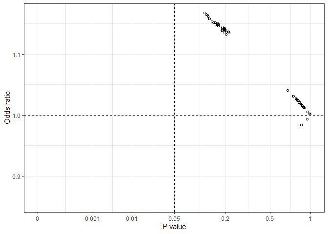
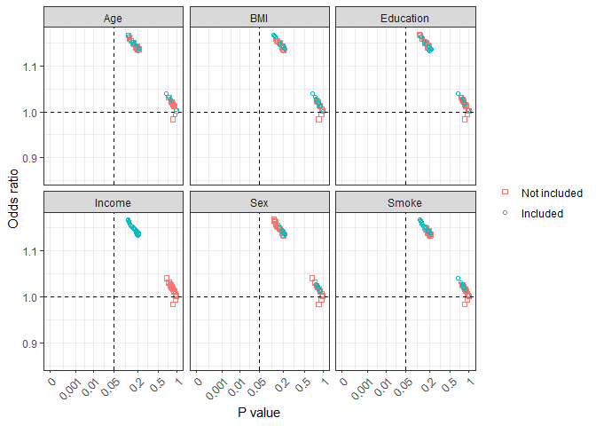

<!-- README.md is generated from README.Rmd. Please edit that file -->

## allestimates: Effect Estimates from All Possible Models

<!-- badges: start -->

<!-- badges: end -->

Calculates effect estimates from models with all possible combinations
of a list of variables specified by users. Effect estimates can be
regression coefficients, odds ratios and hazard ratios depending on
modeling methods. This approach can be used for assessing treatment
effects in clinical trials or the effects of a risk factor in
observational biomedical and epidemiological studies.

## Installation

You can install the released version of allestimates from
[CRAN](https://CRAN.R-project.org) with:

``` r
install.packages("allestimates")
```

## Example

Using `diab_df` data to assess the association between marital status
`Married` and and `Diabetes` as an example. Several other factors might
potentially influence the association (odds ratio estimates) between
`Married` and `Diabetes` variables.

``` r
library(allestimates)
data(diab_df)
diab_df$Overweight = as.numeric(diab_df$BMI >= 25)
vlist <- c("Age", "Sex", "Education","Smoke", "BMI", "Income")
results <- all_speedglm(crude = "Diabetes ~ Married",  xlist = vlist, data = diab_df)
#> estimate: Odds Ratio or Rate Ratio
#> Crude model: Diabetes ~ Married
```

All those possible effect estimates (odds ratios in this case) are
stored in an object `results` and can be used later for further analysis
and generating various graphs.

``` r
all_plot(results)
```

 From this
`all_plot` graph, we can see that all estimated odds ratio values fell
in the left-side two quarters, with either a positive or a negative
association but p values in all possible models were greater than 0.05.

``` r
all_plot2(results)
```



`all_plot2` graph shows effect estimates with a specific variable being
included or not included in the model. This can be helpful in
combination with biological background knowledge to understand potential
confounding effects, uncertainly of the effect estimates, and
inappropriate inclusion of some variables.

***Note***: Interaction terms and other derived variables can be listed.
Those terms need to be generated first before running an `allestimates`
function.
