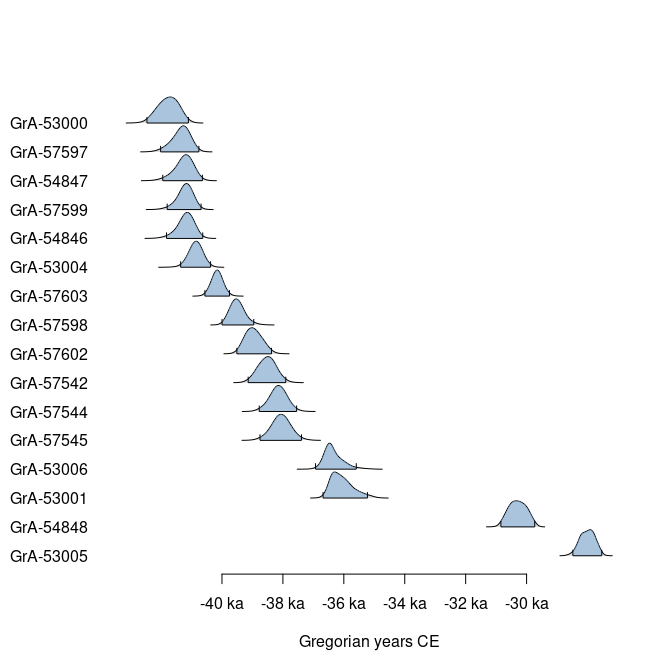

<!-- README.md is generated from README.Rmd. Please edit that file -->

# ananke

<!-- badges: start -->

[](https://packages.tesselle.org/ananke/coverage/)
<a href="https://tesselle.r-universe.dev/ananke"
class="pkgdown-devel"></a>

[](https://www.repostatus.org/#wip)

[](https://doi.org/10.5281/zenodo.13236285)
<!-- badges: end -->

## Overview

Simple radiocarbon calibration and chronological analysis. This package
allows the calibration of radiocarbon ages and modern carbon fraction
(F<sup>14</sup>C) values using multiple calibration curves. It allows
the calculation of highest density region intervals and credible
intervals. The package also provides tools for visualising results and
estimating statistical summaries.

This package is currently *experimental*. This means that it is
functional, but interfaces and functionalities may change over time,
testing and documentation may be lacking.

------------------------------------------------------------------------

To cite ananke in publications use:

Frerebeau N (2025). *ananke: Quantitative Chronology in Archaeology*.
Université Bordeaux Montaigne, Pessac, France.
<doi:10.5281/zenodo.13236285> <https://doi.org/10.5281/zenodo.13236285>,
R package version 0.1.0, <https://packages.tesselle.org/ananke/>.

This package is a part of the tesselle project
<https://www.tesselle.org>.

## Installation

You can install the released version of **ananke** from
[CRAN](https://CRAN.R-project.org) with:

``` r
install.packages("ananke")
```

And the development version from [Codeberg](https://codeberg.org/) with:

``` r
# install.packages("remotes")
remotes::install_git("https://codeberg.org/tesselle/ananke")
```

## Usage

``` r
## Load packages
library(ananke)
#> Loading required package: aion
```

**ananke** uses [**aion**](https://packages.tesselle.org/aion/) for
internal date representation. Look at
`vignette("aion", package = "aion")` before you start.

``` r
## Data from Bosch et al. 2015
data("ksarakil")

## Calibrate multiple ages
cal <- c14_calibrate(
  values = ksarakil$date,
  errors = ksarakil$error,
  names = ksarakil$code,
  curves = "marine13",
  reservoir_offsets = 53,
  reservoir_errors = 43,
  from = 50000, to = 0
)

## Plot
plot(cal)
```

<!-- -->

## Translation

This package provides translations of user-facing communications, like
messages, warnings and errors, and graphical elements (axis labels). The
preferred language is by default taken from the locale. This can be
overridden by setting of the environment variable `LANGUAGE` (you only
need to do this once per session):

``` r
Sys.setenv(LANGUAGE = "<language code>")
```

Languages currently available are English (`en`) and French (`fr`).

## Related Works

- [**Bchron**](https://github.com/andrewcparnell/Bchron) enables quick
  calibration of radiocarbon dates, age-depth modelling, relative sea
  level rate estimation, and non-parametric phase modelling.
- [**rcarbon**](https://github.com/ahb108/rcarbon) includes functions
  not only for basic calibration, uncalibration, and plotting of one or
  more dates, but also a statistical framework for building demographic
  and related longitudinal inferences from aggregate radiocarbon date
  lists.
- [**rintcal**](https://github.com/Maarten14C/rintcal) consists of a
  data compilation of the IntCal radiocarbon calibration curves and
  provides a number of functions to assist with calibrating dates and
  plotting calibration curves.

## Contributing

Please note that the **ananke** project is released with a [Contributor
Code of Conduct](https://www.tesselle.org/conduct.html). By contributing
to this project, you agree to abide by its terms.

## References

<div id="refs" class="references csl-bib-body hanging-indent"
entry-spacing="0">

<div id="ref-albarede2012" class="csl-entry">

Albarède, F., A.-M. Desaulty, and J. Blichert-Toft. 2012. “A Geological
Perspective on the Use of Pb Isotopes in Archaeometry.” *Archaeometry*
54 (5): 853–67. <https://doi.org/10.1111/j.1475-4754.2011.00653.x>.

</div>

<div id="ref-albarede1984" class="csl-entry">

Albarède, F., and M. Juteau. 1984. “Unscrambling the Lead Model Ages.”
*Geochimica Et Cosmochimica Acta* 48 (1): 207–12.
<https://doi.org/10.1016/0016-7037(84)90364-8>.

</div>

<div id="ref-allegre2005" class="csl-entry">

Allègre, Claude. 2005. *Géologie isotopique*. Belin sup. Paris: Belin.

</div>

<div id="ref-boers2017" class="csl-entry">

Boers, Niklas, Bedartha Goswami, and Michael Ghil. 2017. “A Complete
Representation of Uncertainties in Layer-Counted Paleoclimatic
Archives.” *Climate of the Past* 13 (9): 1169–80.
<https://doi.org/10.5194/cp-13-1169-2017>.

</div>

<div id="ref-bronkramsey2008" class="csl-entry">

Bronk Ramsey, C. 2008. “Radiocarbon Dating: Revolutions in
Understanding.” *Archaeometry* 50 (2): 249–75.
<https://doi.org/10.1111/j.1475-4754.2008.00394.x>.

</div>

<div id="ref-carleton2021" class="csl-entry">

Carleton, W. Christopher. 2021. “Evaluating Bayesian Radiocarbon‐dated
Event Count (REC) Models for the Study of Long‐term Human and
Environmental Processes.” *Journal of Quaternary Science* 36 (1):
110–23. <https://doi.org/10.1002/jqs.3256>.

</div>

<div id="ref-heaton2020" class="csl-entry">

Heaton, Timothy J, Peter Köhler, Martin Butzin, Edouard Bard, Ron W
Reimer, William E N Austin, Christopher Bronk Ramsey, et al. 2020.
“Marine20 The Marine Radiocarbon Age Calibration Curve (0–55,000 Cal
BP).” *Radiocarbon* 62 (4): 779–820.
<https://doi.org/10.1017/RDC.2020.68>.

</div>

<div id="ref-hogg2020" class="csl-entry">

Hogg, Alan G, Timothy J Heaton, Quan Hua, Jonathan G Palmer, Chris SM
Turney, John Southon, Alex Bayliss, et al. 2020. “SHCal20 Southern
Hemisphere Calibration, 0–55,000 Years Cal BP.” *Radiocarbon* 62 (4):
759–78. <https://doi.org/10.1017/RDC.2020.59>.

</div>

<div id="ref-hogg2013" class="csl-entry">

Hogg, Alan G, Quan Hua, Paul G Blackwell, Mu Niu, Caitlin E Buck, Thomas
P Guilderson, Timothy J Heaton, et al. 2013. “SHCal13 Southern
Hemisphere Calibration, 0–50,000 Years Cal BP.” *Radiocarbon* 55 (4):
1889–1903. <https://doi.org/10.2458/azu_js_rc.55.16783>.

</div>

<div id="ref-hua2004" class="csl-entry">

Hua, Quan, and Mike Barbetti. 2004. “Review of Tropospheric Bomb 14C
Data for Carbon Cycle Modeling and Age Calibration Purposes.”
*Radiocarbon* 46 (3): 1273–98.
<https://doi.org/10.1017/S0033822200033142>.

</div>

<div id="ref-hua2013" class="csl-entry">

Hua, Quan, Mike Barbetti, and Andrzej Z Rakowski. 2013. “Atmospheric
Radiocarbon for the Period 1950–2010.” *Radiocarbon* 55 (4): 2059–72.
<https://doi.org/10.2458/azu_js_rc.v55i2.16177>.

</div>

<div id="ref-hua2022" class="csl-entry">

Hua, Quan, Jocelyn C Turnbull, Guaciara M Santos, Andrzej Z Rakowski,
Santiago Ancapichún, Ricardo De Pol-Holz, Samuel Hammer, et al. 2022.
“Atmospheric Radiocarbon for the Period 1950–2019.” *Radiocarbon* 64
(4): 723–45. <https://doi.org/10.1017/RDC.2021.95>.

</div>

<div id="ref-hughen2004a" class="csl-entry">

Hughen, K., S. Lehman, J. Southon, J. Overpeck, O. Marchal, C. Herring,
and J. Turnbull. 2004. “14C Activity and Global Carbon Cycle Changes
over the Past 50,000 Years.” *Science* 303 (5655): 202–7.
<https://doi.org/10.1126/science.1090300>.

</div>

<div id="ref-hughen2004" class="csl-entry">

Hughen, Konrad A, Mike G L Baillie, Edouard Bard, J Warren Beck, Chanda
J H Bertrand, Paul G Blackwell, Caitlin E Buck, et al. 2004. “Marine04
Marine Radiocarbon Age Calibration, 0–26 Cal Kyr BP.” *Radiocarbon* 46
(3): 1059–86. <https://doi.org/10.1017/S0033822200033002>.

</div>

<div id="ref-hyndman1996" class="csl-entry">

Hyndman, Rob J. 1996. “Computing and Graphing Highest Density Regions.”
*The American Statistician* 50 (2): 120.
<https://doi.org/10.2307/2684423>.

</div>

<div id="ref-kueppers2004" class="csl-entry">

Kueppers, Lara M., John Southon, Paul Baer, and John Harte. 2004. “Dead
Wood Biomass and Turnover Time, Measured by Radiocarbon, Along a
Subalpine Elevation Gradient.” *Oecologia* 141 (4): 641–51.
<https://doi.org/10.1007/s00442-004-1689-x>.

</div>

<div id="ref-mccormac2004" class="csl-entry">

McCormac, F G, A G Hogg, P G Blackwell, C E Buck, T F G Higham, and P J
Reimer. 2004. “Shcal04 Southern Hemisphere Calibration, 0–11.0 Cal Kyr
BP.” *Radiocarbon* 46 (3): 1087–92.
<https://doi.org/10.1017/S0033822200033014>.

</div>

<div id="ref-millard2014" class="csl-entry">

Millard, Andrew R. 2014. “Conventions for Reporting Radiocarbon
Determinations.” *Radiocarbon* 56 (2): 555–59.
<https://doi.org/10.2458/56.17455>.

</div>

<div id="ref-vanderplicht2006" class="csl-entry">

Plicht, J van der, and A Hogg. 2006. “A Note on Reporting Radiocarbon.”
*Quaternary Geochronology* 1 (4): 237–40.
<https://doi.org/10.1016/j.quageo.2006.07.001>.

</div>

<div id="ref-reimer2009" class="csl-entry">

Reimer, P J, M G L Baillie, E Bard, A Bayliss, J W Beck, P G Blackwell,
C Bronk Ramsey, et al. 2009. “IntCal09 and Marine09 Radiocarbon Age
Calibration Curves, 0–50,000 Years Cal BP.” *Radiocarbon* 51 (4):
1111–50. <https://doi.org/10.1017/S0033822200034202>.

</div>

<div id="ref-reimer2020" class="csl-entry">

Reimer, Paula J, William E N Austin, Edouard Bard, Alex Bayliss, Paul G
Blackwell, Christopher Bronk Ramsey, Martin Butzin, et al. 2020. “The
IntCal20 Northern Hemisphere Radiocarbon Age Calibration Curve (0–55 Cal
<span class="nocase">kBP</span>).” *Radiocarbon* 62 (4): 725–57.
<https://doi.org/10.1017/RDC.2020.41>.

</div>

<div id="ref-reimer2004" class="csl-entry">

Reimer, Paula J, Mike G L Baillie, Edouard Bard, Alex Bayliss, J Warren
Beck, Chanda J H Bertrand, Paul G Blackwell, et al. 2004. “Intcal04
Terrestrial Radiocarbon Age Calibration, 0–26 Cal Kyr BP.” *Radiocarbon*
46 (3): 1029–58. <https://doi.org/10.1017/S0033822200032999>.

</div>

<div id="ref-reimer2013" class="csl-entry">

Reimer, Paula J, Edouard Bard, Alex Bayliss, J Warren Beck, Paul G
Blackwell, Christopher Bronk Ramsey, Caitlin E Buck, et al. 2013.
“IntCal13 and Marine13 Radiocarbon Age Calibration Curves 0–50,000 Years
Cal BP.” *Radiocarbon* 55 (4): 1869–87.
<https://doi.org/10.2458/azu_js_rc.55.16947>.

</div>

<div id="ref-stuiver1977" class="csl-entry">

Stuiver, Minze, and Henry A. Polach. 1977. “Discussion Reporting of 14C
Data.” *Radiocarbon* 19 (3): 355–63.
<https://doi.org/10.1017/S0033822200003672>.

</div>

<div id="ref-stuiver1998" class="csl-entry">

Stuiver, Minze, Paula J. Reimer, Edouard Bard, J. Warren Beck, G. S.
Burr, Konrad A. Hughen, Bernd Kromer, Gerry McCormac, Johannes van der
Plicht, and Marco Spurk. 1998. “INTCAL98 Radiocarbon Age Calibration,
24,000–0 Cal BP.” *Radiocarbon* 40 (3): 1041–83.
<https://doi.org/10.1017/S0033822200019123>.

</div>

<div id="ref-stuiver1998a" class="csl-entry">

Stuiver, Minze, Paula J. Reimer, and Thomas F. Braziunas. 1998.
“High-Precision Radiocarbon Age Calibration for Terrestrial and Marine
Samples.” *Radiocarbon* 40 (3): 1127–51.
<https://doi.org/10.1017/S0033822200019172>.

</div>

<div id="ref-ward1978" class="csl-entry">

Ward, G. K., and S. R. Wilson. 1978. “Procedures for Comparing and
Combining Radiocarbon Age Determinations: A Critique.” *Archaeometry* 20
(1): 19–31. <https://doi.org/10.1111/j.1475-4754.1978.tb00208.x>.

</div>

</div>
